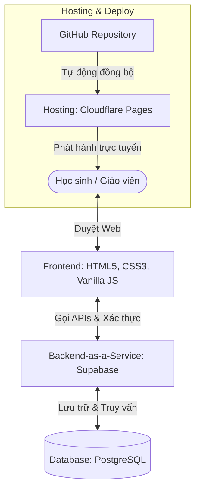

# Bản Đồ Công Nghệ & Kiến Trúc Hệ Thống (Toán Smart)

Tài liệu này cung cấp cái nhìn tổng quan về các công nghệ, công cụ và kiến trúc đang được sử dụng để xây dựng website học tập **Toán Smart**.

---

## 🗺️ Sơ đồ Kiến trúc Hệ thống

---

## 🛠️ Chi Tiết Bản Đồ Công Nghệ

### 1. Frontend (Giao diện người dùng)
*   **HTML5 & CSS3 thuần (Vanilla CSS):** Sử dụng các thuộc tính CSS hiện đại (Flexbox, CSS Variables, Grid) để tạo giao diện phản hồi (Responsive) mượt mà trên cả điện thoại và máy tính mà không cần cài đặt các framework nặng nề (như React/Vue) hay thư viện trung gian (như TailwindCSS). Việc này giúp trang web tải cực nhanh, tối ưu điểm SEO.
*   **JavaScript thuần (Vanilla JS):** Xử lý toàn bộ logic tương tác (nhấn nút, chuyển trang, đóng mở menu, gọi dữ liệu từ Database).
*   **Thư viện bổ sung:**
    *   `FontAwesome 6.4.0`: Cung cấp hệ thống biểu tượng (icons) sắc nét.
    *   `Google Fonts (Outfit)`: Font chữ hiện đại, bo tròn thân thiện.
    *   `SortableJS`: Thư viện xử lý tính năng kéo - thả sắp xếp thứ tự bài học trong trang quản trị của Giáo viên.

### 2. Backend & Database (Hệ thống dữ liệu)
*   **Supabase (Backend-as-a-Service):** 
    *   Thay vì thuê máy chủ (VPS) riêng và tự viết code server (bằng Node.js hoặc Python) tốn hàng trăm nghìn mỗi tháng, chúng ta sử dụng Supabase.
    *   Supabase cung cấp sẵn:
        *   **Cơ sở dữ liệu PostgreSQL:** Lưu trữ thông tin Khóa học, Chương, Bài học, Học liệu.
        *   **Hệ thống Authenticate (Xác thực):** Quản lý tài khoản, mật khẩu của học sinh và phân quyền quản trị (Admin) cho thầy Dương.
        *   **Hệ thống API bảo mật:** Cho phép Frontend kết nối trực tiếp đến Database một cách an toàn.
    *   *Chi phí:* **Miễn phí 100%** cho các dự án nhỏ và vừa.

### 3. Quy Trình Vận Hành & Hosting (Đẩy trang web lên Internet)
*   **GitHub (Quản lý mã nguồn):** Lưu trữ toàn bộ mã nguồn của website tại repository `toan-smart-website`. Đây là nơi lưu trữ an toàn nhất thế giới.
*   **Cloudflare Pages (Đề xuất thay thế Netlify):** 
    *   Nơi lưu trữ và chạy trang web trực tuyến.
    *   Khi có code mới đẩy lên GitHub, Cloudflare Pages sẽ tự động đồng bộ và xuất bản lên Internet trong 10 giây.
    *   *Chi phí:* **Miễn phí 100% cho mục đích thương mại**, không giới hạn băng thông, giới hạn 500 lần cập nhật code/tháng.

---

## 📊 So Sánh Các Giải Pháp Hosting (Nơi đặt Website)

| Tiêu chí | Netlify (Hiện tại) | GitHub Pages | Cloudflare Pages (Đề xuất) | Vercel |
| :--- | :--- | :--- | :--- | :--- |
| **Giá cả** | Miễn phí | Miễn phí | **Miễn phí** | Miễn phí |
| **Thương mại** | Có phép | Không cho phép | **Cho phép** | Không cho phép |
| **Giới hạn build** | 300 phút/tháng (Dễ hết) | Không giới hạn | **500 lần deploy/tháng** (Thoải mái) | 100 giờ build/tháng |
| **Đường dẫn đẹp** | Hỗ trợ tốt | Bị chèn thư mục con | **Hỗ trợ cực tốt** | Hỗ trợ cực tốt |
| **Tốc độ tại VN** | Khá nhanh | Trung bình | **Rất nhanh (Có CDN tại VN)** | Rất nhanh |
